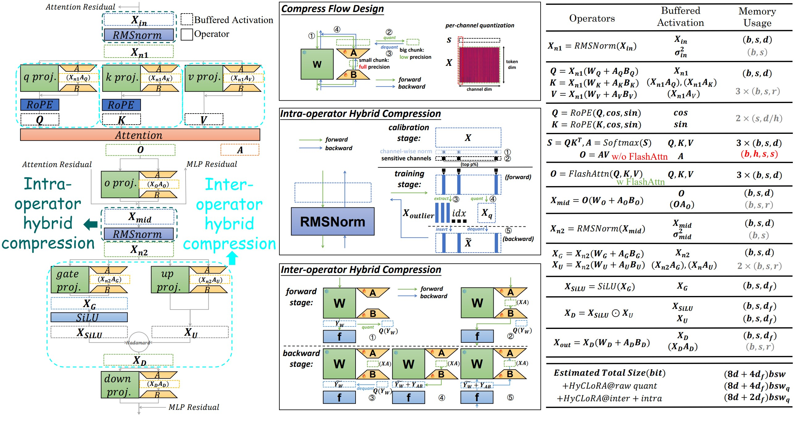

# HyC-LoRA: Memory Efficient LoRA Fine-tuning with Hybrid Activation Compression

[](xxxxxxxx)
[](https://opensource.org/licenses/Apache-2.0)
[](https://www.python.org/downloads/)
[](https://pytorch.org/)

[[Paper](xxxxxxxx)]

<div align="center">
  
  <p>HyC-LoRA's hybrid compression framework combining intra-operator and inter-operator optimizations</p>
</div>

## 📖 Abstract

Large language models (LLMs) face critical memory challenges during on-device fine-tuning. While LoRA reduces trainable parameters, **buffered activation memory** remains a bottleneck. HyC-LoRA addresses this with:

✨ **Key Innovations**:
- **Buffered Activation Mechansim Analysis**: System's view of buffered activation problem in LoRA fine-tuning
- **Two-tier Optimization**:
  - *Intra-operator*: Mitigates quantization errors via outlier detection
  - *Inter-operator*: Error compensation through LoRA adapter fusion
- **System Integration**: Full-stack implementation achieving **3.97× memory reduction** with minimal accuracy loss

## 🚀 Quick Start

### Prerequisites
- CUDA 12.0+
- Python 3.10+
- PyTorch 2.0+

### Installation

```bash
# Clone repository
git clone https://github.com/HyC-LoRA-release
cd HyC-LoRA-release

# Create conda environment (recommended)
conda create -n hyclora python=3.10
conda activate hyclora

# Install dependencies
pip install -r requirements.txt
mkdir <your model dir> # Then download the huggingface models into the dir.
# P.S. It is recommended to use the local model dir to avoid network problems :-(
```

### Run Experiments

GSM8K (llama/mistral):

```bash
$ bash run_gsm8k.sh
```

Wikitext-2 (llama/mistral):

```bash
$ bash run_wikitext2.sh
```

Arithmetic Datasets (llama/mistral):

```bash
$ bash download_datasets.sh # prepare the datasets
$ bash run_multitask.sh
```

GLUE (RoBERTa):

```bash
$ bash run_glue.sh
```

Long Sequence (llama):

download the data from:

* RedPajama training dataset: [link](https://drive.google.com/drive/folders/18Cf9KoGT7NeCZImQL_zvrdKJlIZnf4yW?usp=sharing)
* PG19 validation dataset [link](https://drive.google.com/file/d/1rbJvb0qRIf2mQoN2ON7S93TbTzMnlrN6/view?usp=share_link)
* proof-pile test dataset [link](https://drive.google.com/file/d/1bUI5lPDvrqzY_XXJJ2sSuvZx0Y9AZClE/view?usp=share_link)

put them to `./dataset`, then run:

```bash
$ bash run_longseq.sh
```

## ⚙️ Configuration Guide

The core parameters can be adjusted in these script:

```bash
# model config
model_name=llama-2-7b-hf
model_dir=<your model dir>

# hyclora hyperparameter config
use_hyclora=True
layer_type=intra_inter
iteration_threshold=5
softmax_outlier_ratio=0.05
layernorm_outlier_ratio=0.005
q_bit=4
```

|         Parameter         |                Description                 |                        Options                        |   Default   |
| :-----------------------: | :----------------------------------------: | :---------------------------------------------------: | :---------: |
|       `use_hyclora`       |        Enable HyC-LoRA type training (forward+backward) code        |                     [True, False]                     |    True     |
|       `layer_type`        |            Compression strategy            | [baseline, intra, intra_inter, intra_inter_full_fuse] | intra_inter |
|          `q_bit`          |     Quantization bits for activations      |                       [2, 4,8]                       |      4      |
|  `softmax_outlier_ratio`  |    Outlier threshold for attention maps    |                        0.0-1.0                        |    0.05     |
| `layernorm_outlier_ratio` | Outlier threshold for layernorm/rmsnorm layers |                        0.0-1.0                        |     0.005        |


> explaination of `layer_type`:
> * `baseline`: No compression
> * `intra`: Intra-operator optimization
> * `intra_inter`: Intra-operator optimization + Inter-operator optimization
> * `intra_inter_full_fuse`: Equivalent to `intra_inter` at the algorithmic level, but with kernel fusion for high EMA (external memory access) operations such as LoRA, activation function, Hadamard product, quantization etc. during forward and backward passes


## 🤝 Acknowledgement

Our code is built upon the following projects:

* [LoftQ](https://github.com/yxli2123/LoftQ)
* [ApiQ](https://github.com/BaohaoLiao/ApiQ)
* [LongLoRA](https://github.com/dvlab-research/LongLoRA)
* [unsloth](https://github.com/unslothai/unsloth)

We thank the authors for their open-sourced code.

## 📜 Citation

```
@article{hyclora2024,
  title={HyC-LoRA: Memory Efficient LoRA Fine-tuning with Hybrid Activation Compression},
  author={Anonymous Authors},
  journal={Preprint},
  year={2024},
  url={xxxxxxxx}
}
```
